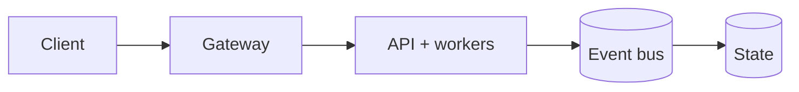

# Scalable Event-Driven Ride-Sharing Platform

[](https://github.com/CoreyLeath-code/Scalable-Event-Driven-Ride-Sharing-Platform/actions/workflows/ci.yml)
[](https://github.com/CoreyLeath-code/Scalable-Event-Driven-Ride-Sharing-Platform/actions/workflows/hygiene-matrix.yml)


This repository models a high-throughput ride-sharing backend using event-driven services,
asynchronous dispatch flows, geospatial matching primitives, dynamic pricing, containerized
deployment assets, and GitHub Actions validation.

The project is intentionally scoped as a production-style reference implementation: measured
local benchmarks are recorded separately from target architecture goals so the README stays
useful for engineering review, not just system-design storytelling.


## Production Readiness Guide

> This section is the portfolio audit entry point for **Scalable-Event-Driven-Ride-Sharing-Platform**. It describes an engineering promotion path; it is not a claim that the repository is already production-authorized.

[](https://github.com/CoreyLeath-code/Scalable-Event-Driven-Ride-Sharing-Platform/actions) [](https://github.com/CoreyLeath-code/Scalable-Event-Driven-Ride-Sharing-Platform/blob/main/LICENSE)

### Architecture flowchart



### Quickstart and local validation

The supported local path should be reproducible from a clean checkout. The inferred stack for this repository is **Python/platform services**.

```bash
python -m venv .venv && source .venv/bin/activate && pip install -r requirements.txt
pytest -q
```

If the project uses external services, model artifacts, cloud credentials, or private data, start them through documented local fixtures or mocks. Never place secrets or identifiable records in the repository.

### Research-style metrics and benchmarks

| Evidence | Required record |
|---|---|
| Correctness | Test command, commit SHA, runtime, and pass/fail result |
| Performance | Warm-up, sample count, concurrency, median, p95, p99, throughput, and memory |
| Data/model quality | Dataset version, split strategy, leakage controls, calibration, subgroup results, and uncertainty |
| Runtime | Image digest, health-check latency, resource limits, and rollback target |
| Security | Dependency, secret, SAST, container, and SBOM results |

A benchmark number belongs in a versioned artifact tied to a commit and hardware/runtime description. Engineering benchmarks must not be presented as clinical, financial, safety, or model-quality validation without the appropriate domain evidence.

### Extended Q&A

**What is production-ready for this repository?**  
A reproducible build, tested public contract, controlled configuration, observable runtime, documented security boundary, versioned artifacts, and a tested rollback path.

**What must remain explicit?**  
The intended use, excluded use, data/credential handling, model or algorithm limitations, and which metrics are measured versus aspirational.

**What should be completed next?**  
Use the linked production-readiness issue for this repository as the checklist. Resolve missing tests, deployment instructions, observability, supply-chain controls, and release evidence before attaching a production claim.


## Architecture

```text
Client / Rider App
    |
    v
API Gateway
    |
    v
Ride Requested Event
    |
    v
Event Bus (Kafka / Redis / RabbitMQ style)
    |
    +--> Matching Engine
    |        |
    |        v
    |   Driver Assigned Event
    |
    +--> Pricing Engine
    |
    +--> Notification / Payment / Trip Lifecycle Extensions
```

Core components:

- API gateway for external ride requests.
- Driver location store for active driver telemetry.
- Event bus abstraction for asynchronous pub/sub workflows.
- Matching engine for candidate ranking and driver assignment.
- Pricing engine for demand/supply surge calculations.
- Infrastructure examples for Docker, Kubernetes, and GitHub Actions.

## Research Benchmarks and Recorded Metrics

Benchmark environment:

- Date recorded: 2026-07-12
- Runtime: CPython 3.12.13 on Windows local workspace
- Command: `python benchmarks/ride_sharing_benchmarks.py --iterations 500 --driver-count 100 --output benchmark-results.json`
- Result artifact: `benchmark-results.json`

### Measured Microbenchmarks

| Area | Workload | Recorded Result | Research Interpretation |
| --- | --- | ---: | --- |
| Event bus publish | 500 in-memory `ride.requested` events | 0.023745 ms avg publish latency | Validates low-overhead async fanout for local simulation. |
| Event delivery | 500 published events | 500 delivered messages | Confirms no message loss in the in-memory event bus harness. |
| Matching engine | 500 matches over 100 candidate drivers | 0.074141 ms avg match latency | Candidate ranking remains sub-millisecond for small local pools. |
| Matching selection | Deterministic synthetic pickup near driver 10 | `driver-10` selected | Confirms nearest-candidate behavior under controlled coordinates. |
| Driver location store | 500 upserts | 0.00402 ms avg upsert latency | In-memory telemetry writes are suitable for unit-level simulation. |
| Pricing engine | 500 surge calculations | 0.004456 ms avg compute latency | Demand/supply pricing calculation is effectively negligible locally. |
| Surge output | Demand 50-59, supply 20 | Last multiplier 1.44x | Confirms high-demand zone pricing response. |

### Engineering Quality Metrics

| Metric | Current Recorded Value | Source |
| --- | ---: | --- |
| Tracked repository files | 57 | Repository inventory |
| Python files | 31 | Repository inventory |
| Test files | 5 | `test_*.py` inventory |
| Passing tests | 8 | `pytest -q --cov=. --cov-report=term-missing` |
| Local coverage | 54% | Current focused core test suite |
| GitHub Actions workflows | 3 | `.github/workflows` |
| Infrastructure manifests | 4 | Docker, compose, Kubernetes |
| Benchmark JSON validation | Passing | `python -m json.tool benchmark-results.json` |
| Formatting | Passing | `black --check . --line-length 100` |
| Linting | Passing | `ruff check .` |
| Static typing scope | Passing on core modules | `mypy ... --ignore-missing-imports` |

### Architecture Target Metrics

These are design targets for a production deployment, not claims from the local benchmark harness.

| Capability | Target |
| --- | ---: |
| Ride request throughput | 10,000+ requests/sec |
| Driver telemetry ingestion | 5,000+ events/sec |
| Matching latency | P95 under 15 ms |
| Event bus propagation | Under 10 ms |
| Service availability | 99.9% |
| Autoscaling response | Under 8 seconds |
| CI/CD pipeline time | Under 90 seconds |

## Validation and CI

The repository now has an explicit validation path:

```bash
python -m pip install -r requirements.txt -r requirements-dev.txt
black --check . --line-length 100
ruff check .
mypy models.py utils.py event_bus.py location_store.py matching_engine.py pricing_engine.py consumer.py --ignore-missing-imports
pytest --cov=. --cov-report=term-missing
python benchmarks/ride_sharing_benchmarks.py --iterations 500 --driver-count 100 --output benchmark-results.json
python -m json.tool benchmark-results.json
```

GitHub Actions now:

- Uses `actions/setup-python` pip caching with `requirements.txt` and `requirements-dev.txt`.
- Installs runtime and development dependencies from committed requirement files.
- Fails on formatting, linting, type, test, and benchmark errors instead of bypassing failures.
- Validates benchmark JSON before artifact upload.
- Uploads benchmark artifacts for review.
- Writes workflow summaries to `GITHUB_STEP_SUMMARY`.
- Builds the actual root `Dockerfile` in the CD workflow instead of nonexistent service Dockerfiles.

## Quick Start

```bash
git clone https://github.com/CoreyLeath-code/Scalable-Event-Driven-Ride-Sharing-Platform.git
cd Scalable-Event-Driven-Ride-Sharing-Platform
python -m pip install -r requirements.txt -r requirements-dev.txt
pytest
```

For the containerized demo:

```bash
docker compose up --build
```

## Event Flow

```text
ride.requested -> matching-service
driver.matched -> trip-service
trip.started -> pricing-service
trip.completed -> payment-service
payment.processed -> notification-service
```

## Project Structure

```text
.
|-- .github/workflows/       # CI, hygiene matrix, and CD workflows
|-- benchmarks/              # JSON-producing benchmark harness
|-- docs/                    # Architecture and metrics notes
|-- infra/kubernetes/        # Deployment and HPA manifests
|-- load-tests/              # Locust scenario
|-- services/                # Service entrypoint examples
|-- shared/                  # Shared config, logging, schema, and event bus adapters
|-- tests/                   # Core behavior tests
|-- Dockerfile
|-- docker-compose.yml
|-- Makefile
|-- requirements.txt
|-- requirements-dev.txt
`-- README.md
```

## Industry-Readiness Notes

Upgrades included in this pass:

- Repaired invalid Python imports that prevented test collection.
- Replaced placeholder tests with behavior tests for event bus, matching, location store, and pricing.
- Added a deterministic benchmark harness with JSON output.
- Added `pyproject.toml` for formatting, pytest, coverage, and Ruff configuration.
- Added committed runtime dependencies in `requirements.txt`.
- Removed CI soft-fail patterns and stale cache keys.
- Updated CD actions to current major versions and valid Docker build inputs.
- Replaced corrupted README sections and stale repository links.

Known remaining gaps for a full production release:

- Coverage is 54%; next priority is adding API router, consumer, broker adapter, and service integration tests.
- `docker-compose.yml` still references service directories that are architectural placeholders.
- Broker adapters require live Kafka, Redis, or RabbitMQ integration environments for end-to-end validation.
- Kubernetes manifests should be parameterized with real image names and deployment environments.
- Authentication, authorization, secrets management, and PII controls need implementation before production use.
# [](https://github.com/CoreyLeath-code/Scalable-Event-Driven-Ride-Sharing-Platform/actions/workflows/ci.yml) [](https://github.com/CoreyLeath-code/Scalable-Event-Driven-Ride-Sharing-Platform/actions/workflows/hygiene-matrix.yml)
