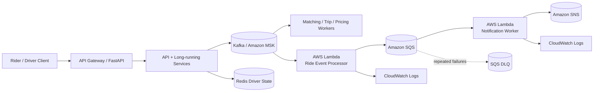

# Scalable Event-Driven Ride-Sharing Platform

[](https://github.com/CoreyLeath-code/Scalable-Event-Driven-Ride-Sharing-Platform/actions/workflows/ci.yml)
[](https://github.com/CoreyLeath-code/Scalable-Event-Driven-Ride-Sharing-Platform/actions/workflows/aws-serverless.yml)
[](https://github.com/CoreyLeath-code/Scalable-Event-Driven-Ride-Sharing-Platform/actions/workflows/hygiene-matrix.yml)


A production-style reference implementation for event-driven ride-sharing backend concepts: asynchronous ride events, driver-location state, matching and pricing primitives, broker adapters, containerized services, load-balancing, reproducible benchmarks, and an optional AWS serverless event-processing path.

The repository intentionally separates **implemented and reproducible behavior** from **production architecture targets**. It does not claim to be a complete live ride-sharing product and does not process real payments, identity data, or production rider/driver PII.

## Architecture

### Hybrid service + serverless design


```mermaid
flowchart LR
    Client[Rider / Driver Client] --> Gateway[API Gateway / FastAPI]
    Gateway --> Services[API + Long-running Services]
    Services --> Kafka[(Kafka / Amazon MSK)]
    Services --> Redis[(Redis Driver State)]

    Kafka --> Matching[Matching / Trip / Pricing Workers]
    Kafka --> Lambda1[AWS Lambda\nRide Event Processor]
    Lambda1 --> SQS[(Amazon SQS)]
    SQS --> Lambda2[AWS Lambda\nNotification Worker]
    SQS -. repeated failures .-> DLQ[(SQS DLQ)]
    Lambda2 --> SNS[(Amazon SNS)]

    Lambda1 --> CW1[CloudWatch Logs]
    Lambda2 --> CW2[CloudWatch Logs]
```

The design deliberately keeps latency-sensitive driver-location and matching responsibilities in long-running services while using Lambda for independently scalable asynchronous work. This avoids treating serverless as a universal replacement for services that may require stable low-latency execution.

### Core event flow

```text
ride.requested -> matching-service
driver.matched -> trip-service
trip.started -> pricing-service
trip.completed -> payment-service
payment.processed -> notification-service
```

The local event-bus abstraction supports asynchronous publish/subscribe behavior and can be backed by Kafka, Redis Streams, or RabbitMQ. The AWS extension adds an Amazon MSK -> Lambda -> SQS -> Lambda -> SNS reference path without removing the local development workflow.

## AWS Lambda serverless extension

The AWS implementation lives under `serverless/` and `infra/aws/`.

### Ride-event processor Lambda

`serverless/ride_event_processor/handler.py` consumes the Amazon MSK event shape, base64-decodes JSON event values, validates that each event contains `event_type` or `type`, and forwards a normalized envelope to SQS.

Each forwarded message includes:

```json
{
  "idempotency_key": "ride.events:0:42",
  "source": "amazon-msk",
  "topic": "ride.events",
  "partition": 0,
  "offset": 42,
  "event": {
    "event_type": "ride.requested",
    "ride_id": "ride-123"
  }
}
```

The `topic:partition:offset` key gives downstream consumers a stable identifier for idempotency in an at-least-once delivery model. The reference handler fails on malformed records or failed SQS sends so the source batch can be retried rather than silently dropped.

### Notification worker Lambda

`serverless/notification_worker/handler.py` consumes the processed-events SQS queue and publishes selected lifecycle events to SNS:

- `driver.matched`
- `trip.started`
- `trip.completed`
- `payment.processed`

It returns SQS partial-batch failure responses so one bad record does not force successful records in the same batch to be retried. Repeatedly failing messages are routed to the configured dead-letter queue.

### Terraform-provisioned AWS resources

`infra/aws/` defines a deployable reference stack for:

- two Python 3.11 Lambda functions;
- processed-events SQS queue;
- SQS dead-letter queue;
- ride-notifications SNS topic;
- CloudWatch log groups with configurable retention;
- separate Lambda execution roles and scoped runtime policies;
- optional Amazon MSK event-source mapping;
- deterministic Lambda ZIP packaging through the Terraform archive provider.

The MSK event-source mapping is disabled when `msk_cluster_arn` is `null`, allowing the Terraform configuration to be statically validated without requiring an existing Kafka cluster.

See [`docs/aws-serverless-architecture.md`](docs/aws-serverless-architecture.md) for event contracts, IAM/networking considerations, deployment steps, and delivery-semantics notes.

## Quick start

### Python validation

```bash
git clone https://github.com/CoreyLeath-code/Scalable-Event-Driven-Ride-Sharing-Platform.git
cd Scalable-Event-Driven-Ride-Sharing-Platform
python -m venv .venv
source .venv/bin/activate
python -m pip install --upgrade pip
python -m pip install -r requirements.txt -r requirements-dev.txt
pytest
```

On Windows PowerShell, activate the environment with `.venv\Scripts\Activate.ps1`.

### Reproduce quality checks and benchmarks

```bash
make reproduce
```

The reproducibility path generates or refreshes evidence artifacts such as `benchmark-results.json`, `coverage.xml`, and `reproducibility-results.json`. Performance or quality numbers should be cited from those generated artifacts together with the commit, runtime, workload, and hardware context that produced them.

### Containerized driver-location demo

```bash
docker compose up --build
curl http://localhost:8000/driver-location/health
curl http://localhost:8000/driver-location/ready
```

The public Compose endpoint uses NGINX in front of driver-location API replicas. The readiness endpoint validates the configured Redis-backed driver store.

### Validate the AWS Terraform configuration

```bash
cd infra/aws
terraform init -backend=false
terraform validate
```

The repository's AWS validation workflow also checks Terraform formatting and validation on relevant pull requests.

### Plan the optional Amazon MSK integration

With AWS credentials configured for a development account:

```bash
cd infra/aws
terraform init
terraform plan \
  -var='aws_region=us-east-1' \
  -var='msk_cluster_arn=arn:aws:kafka:us-east-1:123456789012:cluster/example/uuid'
```

Before applying in a real environment, verify MSK authentication mode, network reachability, topic names, encryption requirements, quotas, and organization-specific IAM controls.

## Project structure

```text
.
|-- .github/workflows/           # CI, AWS validation, hygiene, release, CD
|-- benchmarks/                  # Reproducible benchmark harness
|-- docs/                        # Architecture, failure handling, AWS notes
|-- infra/
|   |-- aws/                     # Lambda/SQS/SNS/MSK Terraform reference
|   `-- kubernetes/              # Kubernetes deployment/HPA manifests
|-- load-tests/                  # Locust scenario
|-- serverless/
|   |-- ride_event_processor/    # Amazon MSK -> SQS Lambda
|   `-- notification_worker/     # SQS -> SNS Lambda
|-- services/                    # Service entrypoint examples
|-- shared/                      # Shared config, logging, event schemas/adapters
|-- tests/                       # Unit and integration behavior tests
|-- Dockerfile
|-- docker-compose.yml
|-- Makefile
|-- pyproject.toml
|-- requirements.txt
`-- README.md
```

## Reliability and failure handling

The project models several failure boundaries instead of assuming a happy path:

- broker adapters are exercised separately from Docker-free unit tests;
- SQS provides buffering between the AWS event processor and notification worker;
- the SQS queue has a dead-letter queue with a bounded receive count;
- the notification worker uses partial-batch responses for record-level retries;
- Kafka metadata is preserved to support downstream idempotency;
- driver-location liveness and readiness are separate endpoints;
- Compose integration validates that the public gateway remains ready after loss of one API replica.

A real production system would still require persistent idempotency storage, alarms, distributed tracing, secrets management, authentication/authorization, PII controls, multi-AZ capacity testing, disaster recovery, payment-provider integration, and documented operational ownership.

## Validation and CI

The main CI workflow validates:

- Docker Compose configuration;
- Black formatting;
- Ruff linting;
- mypy checks for core Python modules;
- pytest behavior and coverage;
- benchmark JSON generation and validation;
- broker integration tests against Docker-hosted Kafka, Redis, and RabbitMQ;
- NGINX/load-balanced driver-location behavior.

The AWS serverless workflow additionally validates:

- Lambda handler unit tests without AWS credentials;
- Terraform formatting;
- Terraform initialization without a backend;
- Terraform static validation.

## Research-style benchmarks and evidence

Measured evidence belongs in generated, versioned artifacts rather than hand-maintained marketing claims.

| Area | Reproduction path | Evidence |
| --- | --- | --- |
| Event-bus publish/delivery | benchmark harness | `benchmark.event_bus` |
| Matching engine | deterministic synthetic candidates | `benchmark.matching` |
| Driver location store | telemetry upserts | `benchmark.location_store` |
| Pricing engine | synthetic demand/supply inputs | `benchmark.pricing` |
| Test coverage | `pytest --cov=.` | `coverage.xml` |
| Quality checks | `make reproduce` / CI | reproducibility command results |
| AWS Lambda behavior | pytest | `tests/test_aws_lambda_handlers.py` |
| AWS IaC validity | Terraform CI | `terraform validate` |

For performance claims, record warm-up behavior, sample count, concurrency, median, p95/p99, throughput, memory, runtime version, commit SHA, and hardware or cloud configuration.

## Architecture targets — not measured production claims

The following remain design targets for a future production deployment. They are **not** asserted as results of the local benchmark harness or the new Lambda reference path.

| Capability | Target |
| --- | ---: |
| Ride request throughput | 10,000+ requests/sec |
| Driver telemetry ingestion | 5,000+ events/sec |
| Matching latency | P95 under 15 ms |
| Event-bus propagation | under 10 ms |
| Service availability | 99.9% |
| Autoscaling response | under 8 seconds |
| CI/CD pipeline time | under 90 seconds |

## Production-readiness boundary

This repository demonstrates engineering patterns and reproducible reference components. A real ride-sharing deployment would still need, at minimum:

- authenticated rider and driver identities;
- authorization and tenant/security boundaries;
- encrypted secrets and PII lifecycle controls;
- production broker/datastore environments;
- payment-provider integration and financial controls;
- durable trip state and transactional consistency rules;
- geospatial indexing appropriate to the selected datastore;
- monitoring, alerting, tracing, SLOs, and incident response;
- capacity, chaos, failover, and disaster-recovery testing;
- environment-specific Kubernetes or cloud deployment configuration;
- security review and supply-chain policy enforcement.

## Engineering roadmap

1. Add persistent idempotency storage for Lambda side effects.
2. Add OpenTelemetry traces that correlate API requests, Kafka offsets, Lambda requests, and SQS message IDs.
3. Add CloudWatch alarms and an operations notification path for Lambda errors, throttles, iterator age, and DLQ depth.
4. Add an integration environment using a real development MSK cluster and record measured end-to-end latency/cost results.
5. Add authentication, secrets management, and explicit PII boundaries before any production claim.
6. Parameterize Kubernetes image names/environments and add deployment promotion/rollback evidence.
7. Expand API, consumer, broker, and AWS integration coverage while keeping unit tests credential-free.

## Q&A

**Why use both Kubernetes/services and Lambda?**  
They solve different workload shapes. Long-running services are retained for latency-sensitive request and state paths, while Lambda handles asynchronous work that benefits from independent event-driven scaling.

**Does this repository deploy Amazon MSK automatically?**  
No. Terraform accepts an existing `msk_cluster_arn`. When the value is omitted, the MSK event-source mapping is not created.

**Does the Lambda code require AWS during tests?**  
No. Unit tests inject fake SQS/SNS clients. `boto3` is imported lazily only when the handlers need a real AWS SDK client at runtime.

**Is the AWS path production-ready?**  
No production claim is made. It is a deployable reference implementation with retries, a DLQ, scoped IAM roles, logging, tests, and Terraform validation. A real deployment still needs environment-specific networking, authentication, observability, security, capacity, and operational evidence.

**Where should measured results live?**  
In versioned generated artifacts tied to a commit and reproduction command, not as uncited numbers in the README.

## License

See [`LICENSE`](LICENSE).
