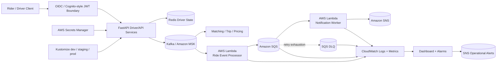

# Scalable Event-Driven Ride-Sharing Platform

[](https://github.com/CoreyLeath-code/Scalable-Event-Driven-Ride-Sharing-Platform/actions/workflows/ci.yml)
[](https://github.com/CoreyLeath-code/Scalable-Event-Driven-Ride-Sharing-Platform/actions/workflows/aws-serverless.yml)
[](https://github.com/CoreyLeath-code/Scalable-Event-Driven-Ride-Sharing-Platform/actions/workflows/kubernetes-validation.yml)
[](https://github.com/CoreyLeath-code/Scalable-Event-Driven-Ride-Sharing-Platform/actions/workflows/hygiene-matrix.yml)


A production-shaped reference implementation for event-driven ride-sharing backend concepts: asynchronous ride events, driver-location state, matching/pricing primitives, Kafka/Redis/RabbitMQ broker adapters, load-balanced APIs, an optional AWS Lambda/MSK path, CloudWatch operations, authentication/secrets/PII boundaries, and evidence-oriented Kubernetes promotion workflows.

**Evidence rule:** implemented behavior, measured evidence, architecture targets, and unexecuted deployment references are kept separate. This repository does not claim to be a live production ride-sharing system and does not claim cloud latency, cost, SLO, security, or deployment results that have not been reproduced.

## Architecture


```mermaid
flowchart LR
    Client[Rider / Driver Client] --> Auth[OIDC / Cognito-style JWT Boundary]
    Auth --> API[FastAPI Driver/API Services]
    Secrets[AWS Secrets Manager] --> API
    API --> Redis[(Redis Driver State)]
    API --> Kafka[(Kafka / Amazon MSK)]

    Kafka --> Matching[Matching / Trip / Pricing]
    Kafka --> Lambda1[AWS Lambda\nRide Event Processor]
    Lambda1 --> SQS[(Amazon SQS)]
    SQS --> Lambda2[AWS Lambda\nNotification Worker]
    SQS -. retry exhaustion .-> DLQ[(SQS DLQ)]
    Lambda2 --> SNS[(Amazon SNS)]

    Lambda1 --> CW[CloudWatch Logs + Metrics]
    Lambda2 --> CW
    SQS --> CW
    DLQ --> CW
    CW --> Dash[Dashboard + Alarms]
    Dash --> Ops[(SNS Operational Alerts)]

    K8s[Kustomize dev / staging / prod] --> API
```

Latency-sensitive driver-location and matching responsibilities remain long-running services. Lambda is used for independently scalable asynchronous work rather than treated as a universal replacement for services that may need stable low-latency execution.

## Implemented engineering boundaries

### Event processing and reliability

- in-memory async event bus plus Kafka, Redis Streams, and RabbitMQ adapters;
- Docker-backed broker round-trip integration tests;
- Amazon MSK -> Lambda -> SQS -> Lambda -> SNS reference path;
- Kafka `topic:partition:offset` idempotency key propagation;
- SQS buffering, bounded retries, DLQ, and partial-batch failure handling;
- NGINX/load-balanced driver-location API with Redis shared state;
- liveness/readiness separation and loss-of-one-replica integration coverage.

### CloudWatch observability

Terraform defines:

- Lambda log groups with retention;
- Lambda invocations, errors, p95 duration, throttles, and concurrency dashboard panels;
- SQS backlog, oldest-message age, and DLQ depth panels;
- log-derived record-level notification failure metric;
- alarms for errors, throttles, high p95 duration, queue lag, DLQ activity, and record failures;
- a dedicated operational SNS topic separate from product notifications.

See [`docs/cloudwatch-observability.md`](docs/cloudwatch-observability.md).

### Authentication, secrets, and PII

Sensitive driver-location collection endpoints support enforced RS256 OIDC JWT validation through `AUTH_REQUIRED=true`. Health/readiness endpoints remain public for infrastructure probes.

Runtime Redis configuration can be resolved from AWS Secrets Manager via `DRIVER_LOCATION_REDIS_SECRET_ID`; local development can use `DRIVER_LOCATION_REDIS_URL`. Terraform can create KMS-protected secret metadata and a least-privilege reader policy, but deliberately does not place secret values in Terraform state.

The asynchronous Lambda path rejects direct identifier fields such as email, phone, names, home addresses, SSNs, and payment/bank identifiers before SQS/SNS fan-out. Event-bus and consumer logs avoid raw event bodies and coordinates.

See [`docs/security-and-pii.md`](docs/security-and-pii.md).

### Kubernetes environments and release evidence

Kubernetes uses one Kustomize base plus explicit `dev`, `staging`, and `prod` overlays. The old hard-coded `yourdockerhub/api-gateway:latest` image is removed.

The deployment now includes:

- parameterized image replacement;
- rolling-update policy with `maxUnavailable: 0`;
- revision history for rollback;
- liveness/readiness probes;
- CPU/memory requests and limits required for meaningful HPA behavior;
- environment-specific auth and Secrets Manager identifiers.

Manual promotion and rollback workflows upload JSON evidence containing environment, source commit, image, rendered-manifest SHA-256, applied/rendered status, and deployment revisions when a real cluster change occurs. Production evidence requires an immutable image digest.

See [`docs/kubernetes-promotion.md`](docs/kubernetes-promotion.md).

## Real Amazon MSK development integration

Terraform can optionally create a **private IAM-authenticated MSK Serverless development cluster** plus an SNS-subscribed SQS probe queue. Both are disabled by default because they create billable resources.

The manual `Real AWS MSK Integration Evidence` workflow is designed for a VPC-connected self-hosted runner. It sends synthetic `trip.completed` events through:

```text
MSK -> Lambda -> SQS -> Lambda -> SNS -> probe SQS
```

and writes min/mean/p50/p95/p99/max wall-clock latency plus a transparent request/runtime cost estimate.

**Current cloud evidence status:** `evidence/aws-msk-integration-results.json` is `not_run`. No real MSK latency or cost result is claimed yet because this chat/repository session does not have an authorized AWS development account and VPC-connected runner. The workflow/harness is implemented so a real run can generate reviewable evidence later.

See [`docs/aws-msk-integration.md`](docs/aws-msk-integration.md).

## Quick start

```bash
git clone https://github.com/CoreyLeath-code/Scalable-Event-Driven-Ride-Sharing-Platform.git
cd Scalable-Event-Driven-Ride-Sharing-Platform
python -m venv .venv
source .venv/bin/activate
python -m pip install --upgrade pip
python -m pip install -r requirements.txt -r requirements-dev.txt
pytest
```

Windows PowerShell activation:

```powershell
.venv\Scripts\Activate.ps1
```

### Run the local Compose demo

```bash
docker compose up --build
curl http://localhost:8000/driver-location/health
curl http://localhost:8000/driver-location/ready
```

### Reproduce quality/benchmark artifacts

```bash
make reproduce
```

### Validate AWS IaC without deploying

```bash
cd infra/aws
terraform fmt -check -recursive
terraform init -backend=false
terraform validate
```

### Render Kubernetes environments

```bash
kustomize build infra/kubernetes/overlays/dev
kustomize build infra/kubernetes/overlays/staging
kustomize build infra/kubernetes/overlays/prod
```

## Authentication configuration

Local development is intentionally credential-free by default:

```text
AUTH_REQUIRED=false
```

For an authenticated environment configure:

```text
AUTH_REQUIRED=true
AUTH_ISSUER=https://your-oidc-issuer
AUTH_AUDIENCE=your-client-or-resource-audience
AUTH_TOKEN_USE=access
```

Staging/prod Kustomize overlays contain explicit issuer/audience placeholders so a real deployment cannot be mistaken for a fully configured identity environment.

## Project structure

```text
.
|-- .github/workflows/
|   |-- ci.yml
|   |-- aws-serverless.yml
|   |-- aws-msk-integration.yml
|   |-- kubernetes-validation.yml
|   |-- kubernetes-promotion.yml
|   `-- kubernetes-rollback.yml
|-- docs/
|-- evidence/
|-- infra/
|   |-- aws/
|   `-- kubernetes/
|       `-- overlays/{dev,staging,prod}/
|-- scripts/
|   |-- aws_msk_e2e.py
|   `-- k8s_release_evidence.py
|-- serverless/
|   |-- ride_event_processor/
|   `-- notification_worker/
|-- tests/
|-- auth.py
|-- runtime_secrets.py
|-- pii_policy.py
|-- Dockerfile
|-- docker-compose.yml
`-- README.md
```

## Validation and test coverage

| Boundary | Credential-free validation | Real integration path |
| --- | --- | --- |
| API | endpoint/store tests + auth dependency tests | authenticated deployment smoke test is environment-specific |
| Consumer | valid/invalid event behavior + PII-safe logging boundary | broker-fed consumer path |
| Kafka/Redis/RabbitMQ | connection-state contract tests | Docker broker round trips |
| Lambda | injected fake SQS/SNS clients + malformed/PII tests | real MSK workflow |
| Terraform | `fmt`, `init -backend=false`, `validate` | manual development apply |
| Kubernetes | render all Kustomize overlays + manifest policy tests | promotion/rollback workflows |

The default pytest marker expression excludes Docker broker integration and real AWS integration markers so unit tests remain credential-free.

## Research-style evidence

Measured evidence belongs in generated/versioned artifacts rather than manually typed marketing numbers.

| Area | Reproduction path | Evidence |
| --- | --- | --- |
| Local event bus / matching / location / pricing | benchmark harness | `benchmark-results.json` |
| Test coverage | pytest-cov | `coverage.xml` |
| Quality checks | `make reproduce` / CI | `reproducibility-results.json` |
| AWS Lambda behavior | pytest | AWS handler/security tests |
| AWS IaC | Terraform CI | `terraform validate` result |
| CloudWatch resources | Terraform CI | `terraform validate` result |
| Real MSK e2e | manual VPC workflow | `aws-msk-integration-results.json` artifact |
| Kubernetes promotion/rollback | manual workflows | rendered manifest + deployment evidence JSON |

For any performance claim, record the source commit, workload, sample count, concurrency, warm-up behavior, median/p95/p99, runtime configuration, and environment. Cost estimates must state their pricing inputs and excluded charges.

## Architecture targets — not measured production claims

| Capability | Design target |
| --- | ---: |
| Ride request throughput | 10,000+ requests/sec |
| Driver telemetry ingestion | 5,000+ events/sec |
| Matching latency | P95 under 15 ms |
| Event-bus propagation | under 10 ms |
| Service availability | 99.9% |
| Autoscaling response | under 8 seconds |
| CI/CD pipeline time | under 90 seconds |

These remain architecture targets until a deployment-specific benchmark produces evidence.

## Production-readiness boundary

The repository now implements authentication hooks, secret retrieval, PII event guards, observability, environment overlays, and deployment evidence workflows. It still does **not** justify a full production claim. Remaining work includes:

- durable idempotency storage and controlled DLQ replay;
- fine-grained authorization/scopes and object-level/tenant access controls;
- OpenTelemetry traces correlating API requests, Kafka offsets, Lambda requests, and SQS messages;
- measured SLIs/SLOs/error budgets with paging and escalation ownership;
- secret rotation procedures and production workload-identity verification;
- capacity, chaos, multi-AZ failover, and disaster-recovery evidence;
- payment/financial controls and durable trip-state consistency;
- production privacy retention/deletion/audit policy;
- security review and supply-chain enforcement tied to the actual deployment.

## Engineering roadmap

1. Persist Lambda idempotency keys and add controlled DLQ replay tooling.
2. Add OpenTelemetry distributed tracing across API, Kafka/MSK, Lambda, and SQS boundaries.
3. Define measured SLIs, SLOs, error budgets, alarm severity, paging, and escalation policy from real traffic.
4. Add fine-grained scopes/roles and object-level authorization beyond authentication.
5. Add CloudWatch Synthetics or equivalent canaries for externally observable paths.
6. Run the real MSK and Kubernetes workflows in an authorized development environment and commit reviewed evidence artifacts.
7. Add capacity, failover, chaos, and disaster-recovery experiments before any production claim.

## Q&A

**Does the repository now automatically create MSK?**  
No. `create_dev_msk_cluster` defaults to `false`. An existing `msk_cluster_arn` can still be supplied, or the optional development MSK Serverless cluster can be explicitly enabled.

**Are real MSK latency numbers in the README?**  
No. The measurement harness exists, but the checked-in evidence says `not_run` until an authorized VPC-connected workflow actually executes.

**Are secrets stored in Terraform?**  
No secret values are created by Terraform. The optional stack creates secret metadata/KMS/policy resources; the secret value is populated out-of-band and fetched at runtime.

**Is authentication enough for production authorization?**  
No. JWT verification establishes an authenticated identity boundary. Fine-grained roles/scopes, tenant boundaries, and object-level policy are still required.

**Why keep containers/Kubernetes if Lambda exists?**  
The workloads have different shapes. Long-running services remain appropriate for latency-sensitive/stateful request paths, while Lambda handles independently scalable asynchronous work.

## License

See [`LICENSE`](LICENSE).
