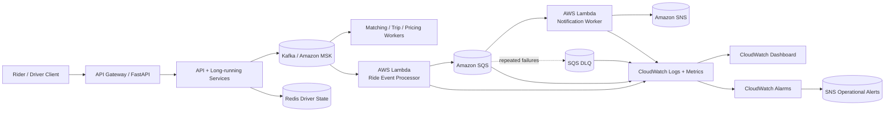

# Scalable Event-Driven Ride-Sharing Platform

[](https://github.com/CoreyLeath-code/Scalable-Event-Driven-Ride-Sharing-Platform/actions/workflows/ci.yml)
[](https://github.com/CoreyLeath-code/Scalable-Event-Driven-Ride-Sharing-Platform/actions/workflows/aws-serverless.yml)
[](https://github.com/CoreyLeath-code/Scalable-Event-Driven-Ride-Sharing-Platform/actions/workflows/hygiene-matrix.yml)


A production-style reference implementation for event-driven ride-sharing backend concepts: asynchronous ride events, driver-location state, matching and pricing primitives, broker adapters, containerized services, load-balancing, reproducible benchmarks, an optional AWS serverless event-processing path, and Terraform-managed CloudWatch observability.

The repository intentionally separates **implemented and reproducible behavior** from **production architecture targets**. It does not claim to be a complete live ride-sharing product and does not process real payments, identity data, or production rider/driver PII.

## Architecture

### Hybrid service + serverless design


```mermaid
flowchart LR
    Client[Rider / Driver Client] --> Gateway[API Gateway / FastAPI]
    Gateway --> Services[API + Long-running Services]
    Services --> Kafka[(Kafka / Amazon MSK)]
    Services --> Redis[(Redis Driver State)]

    Kafka --> Matching[Matching / Trip / Pricing Workers]
    Kafka --> Lambda1[AWS Lambda\nRide Event Processor]
    Lambda1 --> SQS[(Amazon SQS)]
    SQS --> Lambda2[AWS Lambda\nNotification Worker]
    SQS -. repeated failures .-> DLQ[(SQS DLQ)]
    Lambda2 --> SNS[(Amazon SNS)]

    Lambda1 --> CW[CloudWatch Logs + Metrics]
    Lambda2 --> CW
    SQS --> CW
    DLQ --> CW
    CW --> Dashboard[CloudWatch Dashboard]
    CW --> Alarms[CloudWatch Alarms]
    Alarms --> OpsSNS[(SNS Operational Alerts)]
```

The design deliberately keeps latency-sensitive driver-location and matching responsibilities in long-running services while using Lambda for independently scalable asynchronous work. This avoids treating serverless as a universal replacement for services that may require stable low-latency execution.

### Core event flow

```text
ride.requested -> matching-service
driver.matched -> trip-service
trip.started -> pricing-service
trip.completed -> payment-service
payment.processed -> notification-service
```

The local event-bus abstraction supports asynchronous publish/subscribe behavior and can be backed by Kafka, Redis Streams, or RabbitMQ. The AWS extension adds an Amazon MSK -> Lambda -> SQS -> Lambda -> SNS reference path without removing the local development workflow.

## AWS Lambda serverless extension

The AWS implementation lives under `serverless/` and `infra/aws/`.

### Ride-event processor Lambda

`serverless/ride_event_processor/handler.py` consumes the Amazon MSK event shape, base64-decodes JSON event values, validates that each event contains `event_type` or `type`, and forwards a normalized envelope to SQS.

Each forwarded message includes:

```json
{
  "idempotency_key": "ride.events:0:42",
  "source": "amazon-msk",
  "topic": "ride.events",
  "partition": 0,
  "offset": 42,
  "event": {
    "event_type": "ride.requested",
    "ride_id": "ride-123"
  }
}
```

The `topic:partition:offset` key gives downstream consumers a stable identifier for idempotency in an at-least-once delivery model. The reference handler fails on malformed records or failed SQS sends so the source batch can be retried rather than silently dropped.

### Notification worker Lambda

`serverless/notification_worker/handler.py` consumes the processed-events SQS queue and publishes selected lifecycle events to SNS:

- `driver.matched`
- `trip.started`
- `trip.completed`
- `payment.processed`

It returns SQS partial-batch failure responses so one bad record does not force successful records in the same batch to be retried. Repeatedly failing messages are routed to the configured dead-letter queue.

### Terraform-provisioned AWS resources

`infra/aws/` defines a deployable reference stack for:

- two Python 3.11 Lambda functions;
- processed-events SQS queue;
- SQS dead-letter queue;
- ride-notifications SNS topic;
- CloudWatch log groups with configurable retention;
- CloudWatch dashboard, alarms, and log-derived failure metric;
- dedicated operational-alerts SNS topic with optional email subscription;
- separate Lambda execution roles and scoped runtime policies;
- optional Amazon MSK event-source mapping;
- deterministic Lambda ZIP packaging through the Terraform archive provider.

The MSK event-source mapping is disabled when `msk_cluster_arn` is `null`, allowing the Terraform configuration to be statically validated without requiring an existing Kafka cluster.

See [`docs/aws-serverless-architecture.md`](docs/aws-serverless-architecture.md) for event contracts and deployment notes, and [`docs/cloudwatch-observability.md`](docs/cloudwatch-observability.md) for dashboard coverage, alarms, thresholds, triage flow, and the production observability boundary.

## CloudWatch observability

The AWS reference stack now includes an operator-focused observability layer instead of stopping at raw Lambda logs.

### Dashboard coverage

The `${name_prefix}-serverless-observability` dashboard tracks:

- Lambda invocations and invocation-level errors;
- p95 Lambda duration for the ride-event processor and notification worker;
- Lambda throttles and concurrent executions;
- processed-events SQS visible backlog;
- age of the oldest SQS message;
- dead-letter queue depth;
- record-level notification processing failures;
- a CloudWatch Logs Insights table for recent notification worker failures.

Native AWS service metrics are used where possible. A custom `RideSharing/Serverless::NotificationProcessingFailures` metric is derived from the notification worker log stream because SQS partial-batch failures can occur even when the Lambda invocation itself is not counted as a native Lambda `Errors` datapoint.

### Alarm coverage

Terraform creates operational alarms for:

- ride-event processor errors;
- notification worker errors;
- throttling on either Lambda;
- p95 duration approaching the configured Lambda timeout;
- SQS oldest-message age indicating consumer lag;
- any visible message in the DLQ;
- record-level notification processing failures.

All alarms publish to a dedicated operational SNS topic, separate from application ride notifications. Set `alarm_email` to create an optional email subscription; AWS requires confirmation before that subscription begins receiving notifications.

Default thresholds are development/reference values, not claimed production SLOs. They are configurable through Terraform variables and should be replaced with thresholds derived from measured traffic and an explicit SLO/error-budget policy in a real deployment.

## Quick start

### Python validation

```bash
git clone https://github.com/CoreyLeath-code/Scalable-Event-Driven-Ride-Sharing-Platform.git
cd Scalable-Event-Driven-Ride-Sharing-Platform
python -m venv .venv
source .venv/bin/activate
python -m pip install --upgrade pip
python -m pip install -r requirements.txt -r requirements-dev.txt
pytest
```

On Windows PowerShell, activate the environment with `.venv\Scripts\Activate.ps1`.

### Reproduce quality checks and benchmarks

```bash
make reproduce
```

The reproducibility path generates or refreshes evidence artifacts such as `benchmark-results.json`, `coverage.xml`, and `reproducibility-results.json`. Performance or quality numbers should be cited from those generated artifacts together with the commit, runtime, workload, and hardware context that produced them.

### Containerized driver-location demo

```bash
docker compose up --build
curl http://localhost:8000/driver-location/health
curl http://localhost:8000/driver-location/ready
```

The public Compose endpoint uses NGINX in front of driver-location API replicas. The readiness endpoint validates the configured Redis-backed driver store.

### Validate the AWS Terraform configuration

```bash
cd infra/aws
terraform fmt -check -recursive
terraform init -backend=false
terraform validate
```

The repository's AWS validation workflow also checks Terraform formatting and validation on relevant pull requests.

### Plan CloudWatch alerts and optional email delivery

With AWS credentials configured for a development account:

```bash
cd infra/aws
terraform init
terraform plan \
  -var='aws_region=us-east-1' \
  -var='alarm_email=operator@example.com'
```

If `alarm_email` is supplied, the email endpoint must confirm the SNS subscription before alarms can be delivered there.

### Plan the optional Amazon MSK integration

```bash
cd infra/aws
terraform init
terraform plan \
  -var='aws_region=us-east-1' \
  -var='msk_cluster_arn=arn:aws:kafka:us-east-1:123456789012:cluster/example/uuid'
```

Before applying in a real environment, verify MSK authentication mode, network reachability, topic names, encryption requirements, quotas, alarm ownership, and organization-specific IAM controls.

## Project structure

```text
.
|-- .github/workflows/           # CI, AWS validation, hygiene, release, CD
|-- benchmarks/                  # Reproducible benchmark harness
|-- docs/                        # Architecture, AWS, observability, failure handling
|-- infra/
|   |-- aws/                     # Lambda/SQS/SNS/MSK/CloudWatch Terraform reference
|   `-- kubernetes/              # Kubernetes deployment/HPA manifests
|-- load-tests/                  # Locust scenario
|-- serverless/
|   |-- ride_event_processor/    # Amazon MSK -> SQS Lambda
|   `-- notification_worker/     # SQS -> SNS Lambda
|-- services/                    # Service entrypoint examples
|-- shared/                      # Shared config, logging, event schemas/adapters
|-- tests/                       # Unit and integration behavior tests
|-- Dockerfile
|-- docker-compose.yml
|-- Makefile
|-- pyproject.toml
|-- requirements.txt
`-- README.md
```

## Reliability and failure handling

The project models several failure boundaries instead of assuming a happy path:

- broker adapters are exercised separately from Docker-free unit tests;
- SQS provides buffering between the AWS event processor and notification worker;
- the SQS queue has a dead-letter queue with a bounded receive count;
- the notification worker uses partial-batch responses for record-level retries;
- Kafka metadata is preserved to support downstream idempotency;
- CloudWatch alarms surface invocation errors, throttles, high p95 duration, queue lag, DLQ activity, and record-level notification failures;
- a dedicated operational SNS topic separates operator alerts from product-facing ride notifications;
- driver-location liveness and readiness are separate endpoints;
- Compose integration validates that the public gateway remains ready after loss of one API replica.

A real production system would still require persistent idempotency storage, distributed tracing, secrets management, authentication/authorization, PII controls, measured SLOs/error budgets, multi-AZ capacity testing, disaster recovery, payment-provider integration, and documented operational ownership.

## Validation and CI

The main CI workflow validates:

- Docker Compose configuration;
- Black formatting;
- Ruff linting;
- mypy checks for core Python modules;
- pytest behavior and coverage;
- benchmark JSON generation and validation;
- broker integration tests against Docker-hosted Kafka, Redis, and RabbitMQ;
- NGINX/load-balanced driver-location behavior.

The AWS serverless workflow additionally validates:

- Lambda handler unit tests without AWS credentials;
- recursive Terraform formatting;
- Terraform initialization without a backend;
- Terraform static validation, including the CloudWatch dashboard, alarms, SNS alerting, and metric filter resources.

## Research-style benchmarks and evidence

Measured evidence belongs in generated, versioned artifacts rather than hand-maintained marketing claims.

| Area | Reproduction path | Evidence |
| --- | --- | --- |
| Event-bus publish/delivery | benchmark harness | `benchmark.event_bus` |
| Matching engine | deterministic synthetic candidates | `benchmark.matching` |
| Driver location store | telemetry upserts | `benchmark.location_store` |
| Pricing engine | synthetic demand/supply inputs | `benchmark.pricing` |
| Test coverage | `pytest --cov=.` | `coverage.xml` |
| Quality checks | `make reproduce` / CI | reproducibility command results |
| AWS Lambda behavior | pytest | `tests/test_aws_lambda_handlers.py` |
| AWS IaC validity | Terraform CI | `terraform validate` |
| CloudWatch resource validity | Terraform CI | `terraform validate` |

For performance claims, record warm-up behavior, sample count, concurrency, median, p95/p99, throughput, memory, runtime version, commit SHA, and hardware or cloud configuration.

## Architecture targets — not measured production claims

The following remain design targets for a future production deployment. They are **not** asserted as results of the local benchmark harness or the AWS reference path.

| Capability | Target |
| --- | ---: |
| Ride request throughput | 10,000+ requests/sec |
| Driver telemetry ingestion | 5,000+ events/sec |
| Matching latency | P95 under 15 ms |
| Event-bus propagation | under 10 ms |
| Service availability | 99.9% |
| Autoscaling response | under 8 seconds |
| CI/CD pipeline time | under 90 seconds |

## Production-readiness boundary

This repository demonstrates engineering patterns and reproducible reference components. A real ride-sharing deployment would still need, at minimum:

- authenticated rider and driver identities;
- authorization and tenant/security boundaries;
- encrypted secrets and PII lifecycle controls;
- production broker/datastore environments;
- payment-provider integration and financial controls;
- durable trip state and transactional consistency rules;
- geospatial indexing appropriate to the selected datastore;
- measured SLOs, paging policy, escalation paths, tracing, and incident-response ownership;
- capacity, chaos, failover, and disaster-recovery testing;
- environment-specific Kubernetes or cloud deployment configuration;
- security review and supply-chain policy enforcement.

## Engineering roadmap

1. Add persistent idempotency storage for Lambda side effects and controlled DLQ replay tooling.
2. Add OpenTelemetry traces that correlate API requests, Kafka offsets, Lambda requests, and SQS message IDs.
3. Define measured service-level indicators, SLOs, error budgets, alarm severity, and paging/escalation policy.
4. Add an integration environment using a real development MSK cluster and record measured end-to-end latency/cost results.
5. Add CloudWatch Synthetics or equivalent canary coverage for externally observable service paths where it adds value.
6. Add authentication, secrets management, and explicit PII boundaries before any production claim.
7. Parameterize Kubernetes image names/environments and add deployment promotion/rollback evidence.
8. Expand API, consumer, broker, and AWS integration coverage while keeping unit tests credential-free.

## Q&A

**Why use both Kubernetes/services and Lambda?**  
They solve different workload shapes. Long-running services are retained for latency-sensitive request and state paths, while Lambda handles asynchronous work that benefits from independent event-driven scaling.

**Why use native CloudWatch metrics instead of emitting a custom metric for everything?**  
Lambda and SQS already publish useful operational metrics. The reference stack reuses those metrics and adds a custom log-derived metric only for record-level SQS notification failures that can be invisible to the native Lambda `Errors` metric.

**Does this repository deploy Amazon MSK automatically?**  
No. Terraform accepts an existing `msk_cluster_arn`. When the value is omitted, the MSK event-source mapping is not created.

**Does the Lambda code require AWS during tests?**  
No. Unit tests inject fake SQS/SNS clients. `boto3` is imported lazily only when the handlers need a real AWS SDK client at runtime.

**Will setting `alarm_email` immediately send alerts?**  
No. Terraform can create the SNS email subscription, but AWS requires the recipient to confirm the subscription before delivery begins.

**Is the AWS path production-ready?**  
No production claim is made. It is a deployable reference implementation with retries, a DLQ, scoped IAM roles, CloudWatch monitoring/alerting, tests, and Terraform validation. A real deployment still needs environment-specific networking, authentication, persistent idempotency, tracing, measured SLOs, security, capacity, and operational evidence.

**Where should measured results live?**  
In versioned generated artifacts tied to a commit and reproduction command, not as uncited numbers in the README.

## License

See [`LICENSE`](LICENSE).
