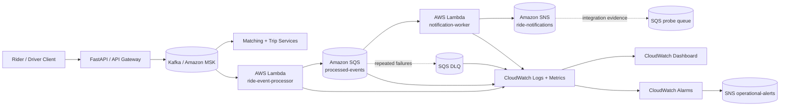

# AWS Serverless Extension

This repository keeps latency-sensitive driver-location and matching paths as long-running services while using AWS Lambda for asynchronous ride-event processing.

## Event flow



## Delivery semantics

The MSK processor fails an invocation when a record cannot be decoded, contains prohibited direct PII, or cannot be handed to SQS. The path is therefore treated as **at least once**. Every forwarded envelope carries a Kafka-derived `topic:partition:offset` idempotency key. A production implementation still needs persistent idempotency enforcement before non-idempotent side effects.

The notification worker uses SQS partial-batch failure responses. Repeatedly failing records eventually move to the DLQ.

## Terraform layout

```text
infra/aws/
|-- main.tf
|-- dev_msk.tf
|-- observability.tf
|-- security.tf
|-- variables.tf
|-- outputs.tf
|-- versions.tf
`-- build/                # generated Lambda ZIPs are ignored
```

The reference stack can define:

- two Python Lambda functions;
- processed-events SQS queue + DLQ;
- rider/driver notification SNS topic;
- CloudWatch dashboard, alarms, log groups, and operator SNS alerts;
- optional existing MSK event-source mapping;
- optional private IAM-authenticated MSK Serverless development cluster;
- optional SNS->SQS integration probe sink;
- optional KMS-protected Secrets Manager metadata and least-privilege reader policy.

All billable development integration and secret resources are disabled by default.

## Validate without AWS credentials

```bash
cd infra/aws
terraform fmt -check -recursive
terraform init -backend=false
terraform validate
```

The regular AWS unit tests inject fake clients and do not contact AWS.

## Real MSK evidence

See [`aws-msk-integration.md`](aws-msk-integration.md). A VPC-connected manual workflow can create a temporary MSK Serverless cluster, run synthetic probes through the complete asynchronous path, generate latency/cost-estimate JSON, and optionally destroy the temporary stack.

No real-cloud number is claimed until that workflow has actually run.

## Security boundaries

See [`security-and-pii.md`](security-and-pii.md). The Lambda ZIPs contain the direct-PII policy so the event boundary is enforced in the deployed function artifact itself rather than only in local application code.

## Observability

See [`cloudwatch-observability.md`](cloudwatch-observability.md) for dashboards, alarm thresholds, Logs Insights coverage, and the monitoring production boundary.
