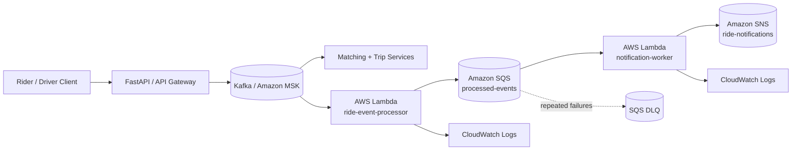

# AWS Serverless Extension

This repository keeps the latency-sensitive driver-location and matching paths as long-running services while adding AWS Lambda for asynchronous event processing. The AWS path is an optional deployment reference; it does not replace the local Kafka/Redis/Docker workflow.

## Event flow



## Why Lambda is used here

Lambda is reserved for asynchronous work that can scale independently from the request path:

- decoding and validating Amazon MSK event batches;
- preserving Kafka topic, partition, and offset as an idempotency key;
- handing events to SQS for retry isolation and buffering;
- publishing selected lifecycle events to SNS;
- reporting per-message SQS failures so successful records are not retried unnecessarily.

Real-time matching and driver-location serving remain container/service concerns in this reference architecture. That avoids claiming that serverless is automatically the best choice for every latency-sensitive workload.

## Delivery semantics

The MSK processor intentionally fails its invocation when a record cannot be decoded or SQS cannot accept the message. Kafka/Lambda delivery is therefore treated as **at least once**. Every forwarded envelope contains an `idempotency_key` derived from `topic:partition:offset`; downstream production consumers should persist and enforce that key before applying non-idempotent side effects.

The notification worker uses SQS partial-batch failure responses. Invalid or failed messages are returned in `batchItemFailures`, allowing successful messages in the same batch to remain complete. After the configured receive limit, repeatedly failing messages move to the dead-letter queue.

## Terraform layout

```text
infra/aws/
|-- versions.tf
|-- variables.tf
|-- main.tf
|-- outputs.tf
`-- build/                # generated Lambda ZIPs are ignored
```

The Terraform configuration creates:

- `ride-event-processor` Lambda;
- `notification-worker` Lambda;
- processed-events SQS queue;
- processed-events dead-letter queue;
- ride-notifications SNS topic;
- CloudWatch log groups with configurable retention;
- separate Lambda execution roles with scoped SQS/SNS permissions;
- optional Amazon MSK event-source mapping.

## Validate without deploying

No AWS credentials are required for formatting and static validation:

```bash
cd infra/aws
terraform init -backend=false
terraform validate
```

The Lambda handlers are covered by normal repository tests and use injected fake AWS clients in tests, so unit validation does not require `boto3`, AWS credentials, or a live AWS account.

## Plan with an Amazon MSK cluster

```bash
cd infra/aws
terraform init
terraform plan \
  -var='aws_region=us-east-1' \
  -var='msk_cluster_arn=arn:aws:kafka:us-east-1:123456789012:cluster/example/uuid'
```

`msk_cluster_arn` defaults to `null`. When it is omitted, Terraform still creates the Lambda/SQS/SNS reference stack but does not create the MSK event-source mapping.

Before applying this against a real environment, verify the cluster's authentication mode, network reachability, Kafka topic name, encryption settings, service quotas, and organization-specific IAM requirements. Production workloads should also add alarms, tracing, secret management, idempotency persistence, load testing, and cost/error-budget controls appropriate to the environment.

## Lambda event contracts

### Amazon MSK input

The processor expects the standard Lambda MSK record shape with base64-encoded JSON in each record's `value` field. The decoded object must contain `event_type` or `type`.

Example decoded event:

```json
{
  "event_type": "ride.requested",
  "ride_id": "ride-123",
  "rider_id": "rider-7"
}
```

Forwarded SQS envelope:

```json
{
  "idempotency_key": "ride.events:0:42",
  "source": "amazon-msk",
  "topic": "ride.events",
  "partition": 0,
  "offset": 42,
  "event": {
    "event_type": "ride.requested",
    "ride_id": "ride-123",
    "rider_id": "rider-7"
  }
}
```

### SQS notification input

The notification worker publishes these event types to SNS:

- `driver.matched`
- `trip.started`
- `trip.completed`
- `payment.processed`

Other valid events are acknowledged and skipped rather than treated as failures.
