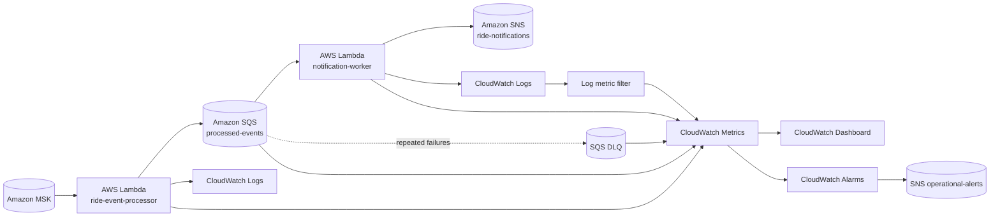

# CloudWatch Observability

This document describes the AWS observability layer for the optional serverless ride-event path. The resources are provisioned through Terraform under `infra/aws/` and are intended as a reproducible reference for monitoring, alerting, and operator investigation.

## Observability flow



## Dashboard

Terraform creates a dashboard named `${name_prefix}-serverless-observability` with six panels:

1. Lambda invocations and errors for both functions.
2. Lambda p95 duration for both functions.
3. Lambda throttles and concurrent executions.
4. Processed-events SQS backlog, oldest-message age, and DLQ depth.
5. Record-level notification-processing failures derived from CloudWatch Logs.
6. A Logs Insights table showing recent notification worker failure messages.

The dashboard uses native AWS service metrics where possible instead of generating duplicate custom telemetry.

## Alarm coverage

The Terraform reference creates alarms for:

- ride-event processor Lambda invocation errors;
- notification worker Lambda invocation errors;
- ride-event processor throttling;
- notification worker throttling;
- ride-event processor p95 duration approaching the 10-second timeout;
- notification worker p95 duration approaching the 10-second timeout;
- processed-events SQS oldest-message age exceeding the configured threshold;
- any visible message in the processed-events dead-letter queue;
- record-level notification failures extracted from the notification worker log stream.

Every alarm publishes to the dedicated `${name_prefix}-operational-alerts` SNS topic. This is intentionally separate from the product-facing ride-notifications SNS topic.

## Configurable thresholds

The defaults are designed for a development/reference deployment, not as universal production SLOs:

```hcl
alarm_email                   = null
lambda_error_threshold        = 1
lambda_duration_alarm_ms      = 8000
sqs_oldest_message_age_seconds = 120
```

`alarm_email` is optional. When supplied, Terraform creates an email subscription to the operational-alerts topic. AWS sends a confirmation message to that endpoint; notifications are not delivered until the subscription is confirmed.

Production thresholds should be derived from measured traffic, latency distributions, retry behavior, queue drain rates, and an explicit SLO/error-budget policy.

## Log-derived metric

The notification worker already logs record-level failures with the message prefix:

```text
Failed to process SQS notification record
```

A CloudWatch Logs metric filter converts matching records into the custom metric:

```text
Namespace: RideSharing/Serverless
Metric:    NotificationProcessingFailures
```

This is useful because an SQS Lambda invocation can succeed at the invocation level while still returning `batchItemFailures` for individual records. The native Lambda `Errors` metric alone would not expose that condition.

## Failure triage

When an alarm fires, investigate in this order:

1. **DLQ alarm:** inspect the dead-letter message payload and its preserved Kafka `topic:partition:offset` idempotency key before replaying anything.
2. **SQS age alarm:** compare queue depth, oldest-message age, Lambda concurrency, throttles, and notification worker duration.
3. **Lambda error alarm:** inspect the relevant Lambda log group for decode, SDK, permission, or downstream service errors.
4. **Record-level notification alarm:** use the dashboard Logs Insights panel to identify the failed SQS message IDs and error context.
5. **Duration alarm:** determine whether the increase is caused by downstream AWS API latency, large batches, cold starts, or insufficient memory/concurrency settings.

Do not automatically replay DLQ events unless downstream side effects are proven idempotent.

## Validation

Static validation requires no AWS credentials:

```bash
cd infra/aws
terraform fmt -check -recursive
terraform init -backend=false
terraform validate
```

The repository's `AWS Serverless Validation` workflow runs these checks on pull requests that change `infra/aws/`.

## Production boundary

This observability layer is a deployable monitoring reference, not evidence of a live production SRE program. A production deployment should additionally define:

- explicit service-level indicators and objectives;
- alarm severity and paging policy;
- escalation and runbook ownership;
- distributed tracing and cross-service correlation IDs;
- persistent idempotency enforcement and controlled DLQ replay tooling;
- PII-safe logging policy and log-access controls;
- cost budgets and CloudWatch retention policy;
- synthetic canaries where appropriate;
- multi-region or disaster-recovery monitoring if required by the service tier.
